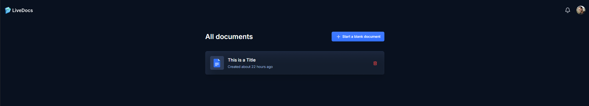
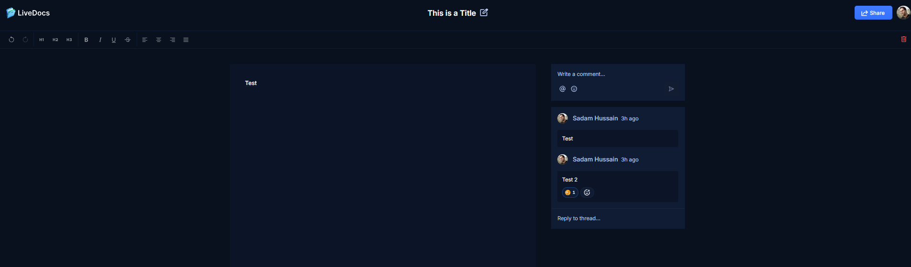
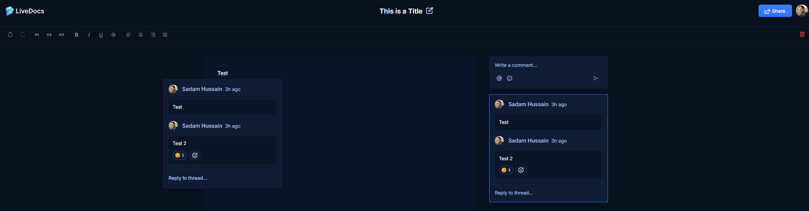
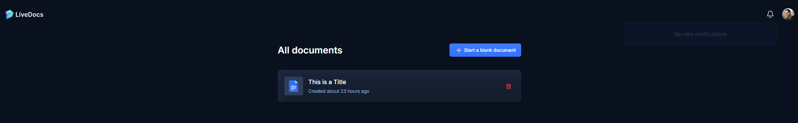
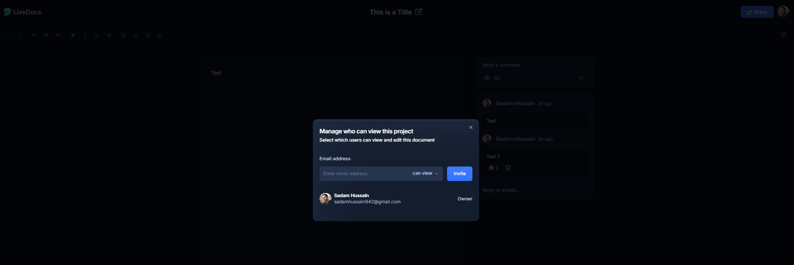

# LIVE DOCS


LIVE DOCS is a next-generation platform for real-time document collaboration. Built with Next.js, LiveBlocks, and Clerk, it offers seamless document creation, sharing, and editing with live updates, robust user management, and comprehensive application monitoring using Sentry.

## Table of Contents

- [Features](#features)
- [Technologies Used](#technologies-used)
- [Getting Started](#getting-started)
- [Screenshots](#screenshots)
- [Contributing](#contributing)
- [License](#license)
- [Contact](#contact)

## Features

- **Create New Documents:** Easily create and manage new documents with an intuitive interface.
- **Share/Invite a Collaborator:** Effortlessly collaborate by sharing documents and inviting others to edit.
- **Real-Time Updates:** Experience live updates as you and your team edit documents.
- **Real-Time Notifications:** Receive instant notifications about document changes and activities.
- **User Notifications:** Stay informed with personalized notifications tailored to your activities.
- **User Access Management:** Control user access and permissions effectively with a robust management system.
- **Application Metrics with Sentry:** Monitor application performance and track errors with Sentry.

## Technologies Used

- **Next.js:** A powerful React framework for building fast, user-friendly web applications.
- **LiveBlocks:** Enables real-time collaborative editing with low latency.
- **Clerk:** Provides authentication, user management, and security.
- **Sentry:** Monitors application performance and error tracking.
- **TypeScript:** Ensures type safety and enhances code maintainability.
- **React:** A JavaScript library for building user interfaces.

## Getting Started

### Prerequisites

- Node.js
- npm or yarn
- MongoDB or any preferred database

### Installation

1. **Clone the repository:**
    ```bash
    git clone https://github.com/sadamkhan7679/live-docs.git
    ```
2. **Navigate to the project directory:**
    ```bash
    cd live-docs
    ```
3. **Install dependencies:**
    ```bash
    npm install
    ```
4. **Set up environment variables:**
    ```plaintext
    NEXT_PUBLIC_LIVEBLOCKS_KEY=your_liveblocks_key
    NEXT_PUBLIC_CLERK_FRONTEND_API=your_clerk_frontend_api
    CLERK_API_KEY=your_clerk_api_key
    SENTRY_DSN=your_sentry_dsn
    ```
5. **Start the development server:**
    ```bash
    npm run dev
    ```
6. **Open [http://localhost:3000](http://localhost:3000) to view it in the browser.**

## Screenshots


*The intuitive dashboard provides easy access to all your documents.*


*Real-time collaborative editing ensures everyone stays updated.*


*Easily add comments and suggestions to documents.*


*Stay informed with real-time notifications about document activities.*


*Effortlessly share documents and invite collaborators to edit.*


## Contributing

We welcome contributions! Please read our [contributing guidelines](URL_TO_CONTRIBUTING_GUIDELINES) before making any contributions.

## License

This project is licensed under the MIT License - see the [LICENSE](LICENSE) file for details.

## Contact

For any questions or inquiries, please contact:

- Sadam Hussain
- Email: sadamhussain942@gmail.com

